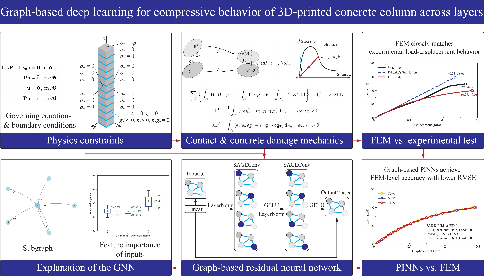
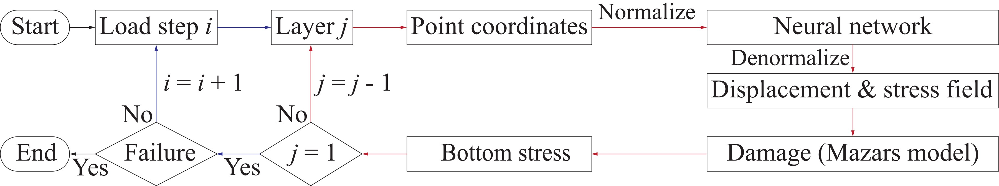
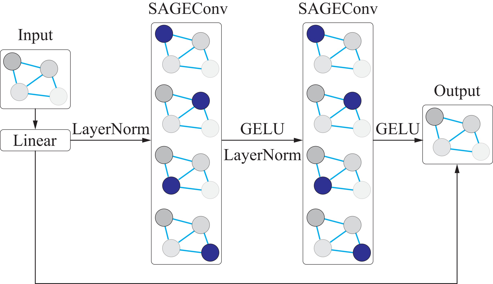
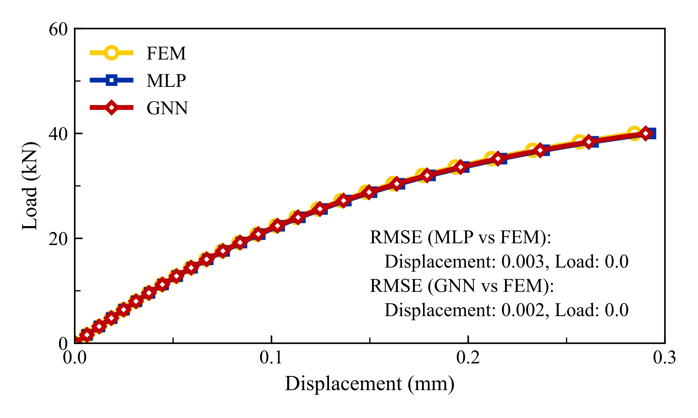

# Graph-Based Deep Learning for the Compressive Behavior of 3D-Printed Concrete Columns

Reference implementation for the study *Graph-Based Deep Learning for Compressive Behavior of
3D-Printed Concrete Columns across Layers*, accepted for publication in
**Advances in Structural Engineering** (manuscript ASE-26-0614.R1).

The repository provides two parallel routes to the compressive response of extrusion-based
3D-printed concrete (3DPC): an open-source finite element (FEM) formulation with node-to-surface
interlayer contact and Mazars damage, and physics-informed neural networks (PINNs) built on either
a multilayer perceptron (MLP) or a residual graph neural network (GNN).



## Motivation

Layer-by-layer deposition makes 3DPC anisotropic and gives it comparatively weak interlayer bonds,
so its mechanical response depends on how load transfers across printed interfaces. Most
machine-learning studies of 3DPC are purely data-driven and predict peak strength only. This work
instead embeds the governing mechanics into learning, resolves full displacement and stress fields,
and evaluates whether graph-based message passing offers an advantage over a conventional MLP.

## Key results

The benchmark is an eleven-layer 3DPC column (40 x 40 x 15 mm per layer) under perpendicular
compression, validated against the experiment of Telichko et al. (2024).

| Quantity | Result |
| --- | --- |
| FEM peak load vs. experiment | -19.5 % |
| FEM displacement error | 7.7 % |
| Displacement RMSE, residual GNN | 0.002 mm (90 trainable parameters) |
| Displacement RMSE, MLP | 0.003 mm (141 trainable parameters) |
| Minimum-SNR ratio, MLP-to-GNN | approx. 1.4x |

Explainability analysis identifies the z-coordinate as dominant near the loaded surface and in the
column interior, while tangential coordinates govern the interlayer response.

<p align="center">
  
</p>
<p align="center"><em>Incremental-iterative framework coupling contact and damage mechanics with physics-informed graph learning.</em></p>

<p align="center">
  
</p>
<p align="center"><em>GraphSAGE-based residual network for displacement and stress prediction.</em></p>

<p align="center">
  
</p>
<p align="center"><em>FEM, MLP and GNN load-displacement responses and displacement RMSEs.</em></p>

## Repository structure

```
pc/
├── main.py                     Entry points for the FEM, PINN, GNN and explainability runs
├── configs/                    YAML cases: material, damage, geometry, mesh and contact parameters
├── data/                       Experimental and reference load-displacement curves
├── fem/
│   ├── config_loader.py        YAML to typed parameter objects
│   ├── parameters.py           Parameter containers
│   ├── fem/
│   │   ├── geo_mesh.py         Layered geometry and hexahedral meshing (Gmsh)
│   │   ├── elements.py         Hexahedral and node-to-surface contact elements
│   │   ├── materials.py        Quadrilinear and five-line concrete laws
│   │   ├── damage.py           Mazars (original, Torch), modified Mazars and mu-damage models
│   │   ├── boundary_conditions.py
│   │   ├── solvers.py          Incremental-iterative solution
│   │   ├── analysis.py, damage_analysis.py
│   │   └── finite_element_method.py   Driver: contact analysis and post-processing
│   ├── utils/                  Logging and helpers
│   └── visualization/          Result plotting, including the figures used in the paper
├── dl/
│   ├── pinn/                   MLP-based PINN: geometry, networks, PDE residuals, scaling,
│   │                           contact boundary conditions, incremental pressure application
│   └── graph/                  Graph counterpart: residual GraphSAGE, graph PDE residuals,
│                               incremental loading and the GNNExplainer-based analysis
├── test/                       Unit tests for the FEM and PINN components
├── requirements.txt
└── run_main.slurm              Example SLURM submission script
```

Simulation output (logs, checkpoints, VTU fields) is written to `pc/log/` at run time and is not
tracked in this repository because of its size.

## Installation

Python 3.10 with a CUDA 11.8 build of PyTorch was used for all reported results; the code also runs
on CPU.

```bash
git clone https://github.com/ZhangHaoyou/3DPC-FEM-PIGNN.git
cd 3DPC-FEM-PIGNN/pc
python -m venv .venv && source .venv/bin/activate   # Windows: .venv\Scripts\activate
pip install -r requirements.txt
```

`torch`, `torch-geometric` and the `torch_scatter` / `torch_sparse` / `torch_cluster` extensions are
pinned to `+cu118` wheels. Install them from the matching PyTorch and PyG index if your CUDA
version differs, or substitute the CPU builds.

## Usage

All analyses are launched from `pc/main.py`; uncomment the required entry point at the bottom of the
file and run it from the `pc/` directory.

```bash
cd pc
python main.py
```

| Entry point | Purpose |
| --- | --- |
| `main_fem()` | Incremental FEM analysis with node-to-surface contact and Mazars damage |
| `main_pinn()` | MLP-based physics-informed network under incremental pressure |
| `main_graph()` | Residual GraphSAGE physics-informed network |
| `main_graph_interpretation()` | Feature importance and explanatory subgraphs for trained GNNs |
| `main_graph_analysis()` | Benign-generalization analysis of the graph architecture |

A random seed of 2025 and deterministic cuDNN settings are fixed in the learning entry points, so
reported runs are reproducible on identical hardware.

## Configuration

Cases are defined in `pc/configs/*.yaml` and cover concrete properties, damage parameters, geometry,
mesh size and contact penalty stiffness. `config.yaml` reproduces the column analysed in the paper;
the remaining files reproduce the damage-model verification cases (Mazars 2015/2017, Debuisne,
Pijaudier-Cabot and the mu-model). All quantities use mm, N, MPa, ton and second.

## Data

`pc/data/` contains the digitised experimental curve of Telichko et al. (2024), their reported
simulation, and the load-displacement response produced by the present FEM. These are the series
compared in the paper.

## Citation

Please cite the paper if you use this code.

```bibtex
@article{zhang2026graph,
  title   = {Graph-Based Deep Learning for Compressive Behavior of 3D-Printed Concrete Columns across Layers},
  author  = {Zhang, Haoyou and Wan, Baolin},
  journal = {Advances in Structural Engineering},
  year    = {2026},
  note    = {In press}
}
```

## License

Released under the MIT License; see [LICENSE](LICENSE).

## Contact

Haoyou (Ethan) Zhang, Department of Civil, Construction, and Environmental Engineering,
Marquette University, Milwaukee, WI, USA. Questions about this repository:
haoyou.zhang@marquette.edu.
